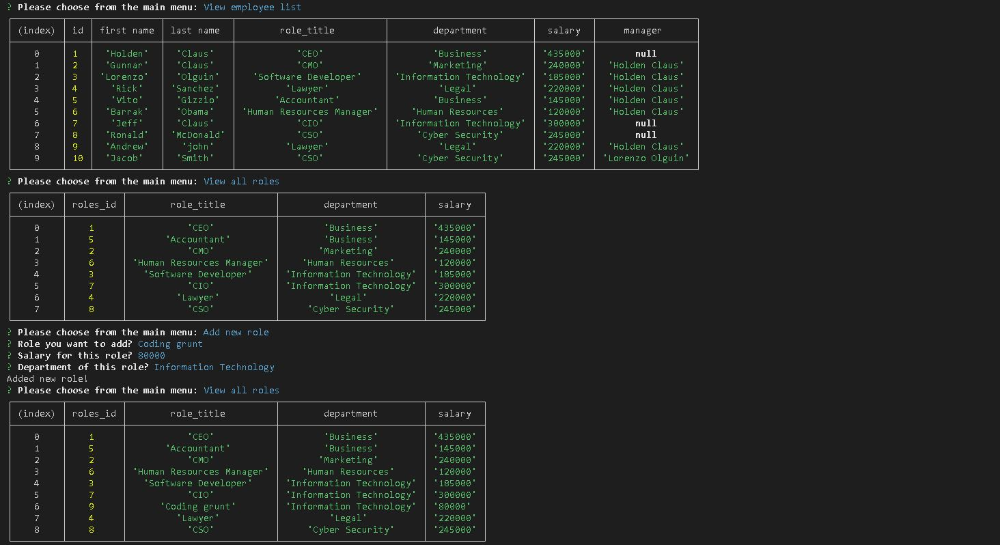
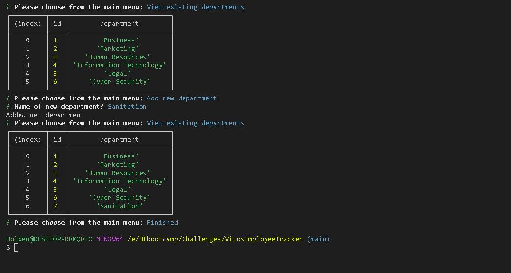

# VitosEmployeeTracker

## Table of Contents
  * [Description](#description)
  * [Visuals](#visuals)
  * [installation instructions](#installation)
  * [License](#license)
  * [Contributing](#contribution)
  * [Questions](#contact-information)

## Description
EmployeeTracker that can be used to track and manage employee information such as roles and salaries

## Visuals

Link to video on how to use:
https://drive.google.com/file/d/1DC53crCZCejX5F-yZlGp8X8LndtimByW/view

## Installation
Make sure you have ran the database setup before running the command 
- node index.js

## License
  

## Contributing
- Erin Peifer - https://github.com/Airen22
- Camelia Benavides - https://github.com/cameliabenavides10
- Michael Smith - https://github.com/AustinBQ02

## Contact Information
  * GitHub Username: [HoldyClaus](https://github.com/HoldyClaus)